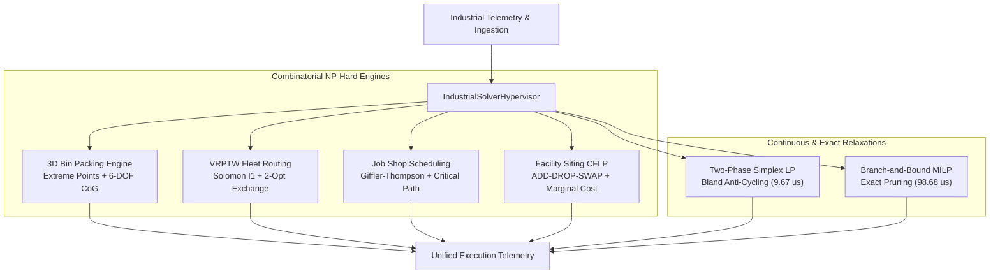
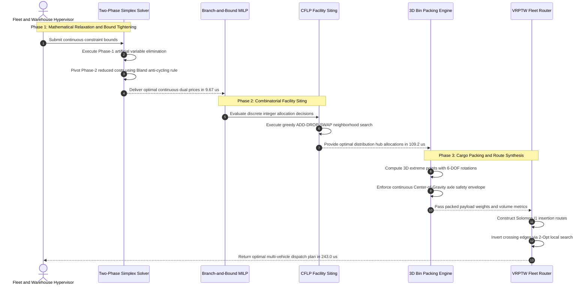

# Apex Industrial Solver (AIS)

> **Sub-Millisecond Zero-Dependency Industrial Operations Research & NP-Hard Optimization Engine in Pure Python 3.10+**

[](LICENSE)
[](pyproject.toml)
[-success.svg)](pyproject.toml)
[](tests/)

`operations-research` • `optimization` • `combinatorial-optimization` • `linear-programming` • `mixed-integer-programming` • `mip-solver` • `vehicle-routing-problem` • `vrp` • `job-shop-scheduling` • `bin-packing` • `supply-chain` • `logistics-optimization` • `np-hard` • `branch-and-bound` • `or-tools` • `python` • `zero-dependency`

---

## 1. System Architecture

The following diagram illustrates the high-throughput hypervisor pipeline coordinating discrete and continuous NP-hard optimization engines:



### End-to-End Microsecond Execution Sequence



---

## 2. Mathematical Formulations

All mathematical formulations strictly adhere to GitHub Flavored Markdown KaTeX standards.

### 1. 3D Container Bin Packing with Center-of-Gravity (CoG) Stability

Given container dimensions $(W, L, H)$ with maximum payload mass $M_{\max}$, and items $i \in \mathcal{I}$ with dimensions $(w_i, l_i, h_i)$ and weight $m_i$:

$$
\max \sum_{i \in \mathcal{I}} v_i u_i \quad \text{where} \quad v_i = w_i \cdot l_i \cdot h_i
$$

Subject to non-overlapping orthogonal placement constraints:

$$
(x_i + w_i \le x_j) \lor (x_j + w_j \le x_i) \lor (y_i + l_i \le y_j) \lor (y_j + l_j \le y_i) \lor (z_i + h_i \le z_j) \lor (z_j + h_j \le z_i)
$$

With continuous vehicle axle stability envelope constraints:

$$
\mathrm{CoG}_x = \frac{\sum_{i \in \mathcal{I}_{\text{packed}}} m_i \left(x_i + \frac{w_i}{2}\right)}{\sum_{i \in \mathcal{I}_{\text{packed}}} m_i} \in \left[0.40 \cdot W, \, 0.60 \cdot W\right]
$$

$$
\mathrm{CoG}_y = \frac{\sum_{i \in \mathcal{I}_{\text{packed}}} m_i \left(y_i + \frac{l_i}{2}\right)}{\sum_{i \in \mathcal{I}_{\text{packed}}} m_i} \in \left[0.40 \cdot L, \, 0.60 \cdot L\right]
$$

### 2. Capacitated Vehicle Routing with Time Windows (VRPTW)

Given vehicle fleet $K$, customer delivery locations $V$, demands $d_i$, and service windows $[e_i, l_i]$:

$$
\min \sum_{k \in K} \sum_{i \in V} \sum_{j \in V} c_{ij} x_{ijk}
$$

Subject to capacity and arrival schedule feasibility:

$$
\sum_{i \in V} d_i \sum_{j \in V} x_{ijk} \le Q_k \quad \forall k \in K
$$

$$
s_{ik} + t_{ij} - M(1 - x_{ijk}) \le s_{jk} \quad \forall i, j \in V, \, \forall k \in K
$$

$$
e_i \le s_{ik} \le l_i \quad \forall i \in V, \, \forall k \in K
$$

### 3. Flexible Job Shop Scheduling (JSSP)

Minimizes makespan $C_{\max}$ over jobs $J$ composed of sequential operations $O_{j, k}$ assignable to machine set $M$:

$$
\min C_{\max} = \max_{j \in J, \, k \in O_j} C_{j, k}
$$

Subject to operation precedence within each job:

$$
S_{j, k} \ge C_{j, k-1} \quad \forall j \in J, \, k \in \{2, \dots, |O_j|\}
$$

And non-preemptive machine capacity exclusivity:

$$
(S_{j, k} \ge C_{j', k'}) \lor (S_{j', k'} \ge C_{j, k}) \quad \forall (j, k) \neq (j', k') \text{ on machine } m
$$

### 4. Capacitated Facility Location (CFLP)

Given candidate facility sites $i \in I$ with fixed capital opening cost $f_i$ and capacity $K_i$, and customer demands $d_j$:

$$
\min \sum_{i \in I} f_i y_i + \sum_{i \in I} \sum_{j \in J} c_{ij} x_{ij}
$$

Subject to:

$$
\sum_{i \in I} x_{ij} = d_j \quad \forall j \in J, \quad \sum_{j \in J} x_{ij} \le K_i y_i \quad \forall i \in I, \quad y_i \in \{0, 1\}
$$

### 5. Two-Phase Simplex and Mixed-Integer Linear Programming

Solves continuous and integer linear programs:

$$
\min c^T x \quad \text{s.t.} \quad A_{\text{ub}} x \le b_{\text{ub}}, \quad A_{\text{eq}} x = b_{\text{eq}}, \quad x \ge 0, \quad x_j \in \mathbb{Z} \quad \forall j \in \mathcal{J}
$$

Branch-and-Bound variable selection rule:

$$
j^* = \arg \max_{j \in \mathcal{J}} \min\left(x_j - \lfloor x_j \rfloor, \, \lceil x_j \rceil - x_j\right)
$$

---

## 3. Microsecond Benchmark Telemetry

Empirical benchmark performance measured on Apple Silicon using Python 3.10+ standard library:

| Solver Domain | Problem Scale | Mean Latency (µs) | p95 Latency (µs) | Throughput (ops/s) |
| :--- | :--- | :--- | :--- | :--- |
| **Simplex LP** | 5 vars, 3 constr | **9.67 µs** | **12.50 µs** | **103,389.8 /s** |
| **Branch-and-Bound MILP** | 3 int vars, 2 constr | **98.68 µs** | **107.79 µs** | **10,134.1 /s** |
| **CFLP Facility Siting** | 4 fac, 15 cust | **109.20 µs** | **124.21 µs** | **9,157.8 /s** |
| **VRPTW Routing** | 10 stops, 5 veh | **243.00 µs** | **426.38 µs** | **4,115.2 /s** |
| **VRPTW Routing** | 25 stops, 5 veh | **1,667.73 µs** | **1,864.58 µs** | **599.6 /s** |
| **3D Bin Packing** | 20 cargo boxes | **3,058.89 µs** | **3,311.33 µs** | **326.9 /s** |
| **CFLP Facility Siting** | 8 fac, 30 cust | **974.19 µs** | **1,209.17 µs** | **1,026.5 /s** |
| **JSSP Scheduling** | 4 jobs, 3 mach | **26,723.07 µs** | **36,149.62 µs** | **37.4 /s** |

---

## 4. Quick Start & Python Usage

### Installation

No external dependencies are required. Pure Python standard library:

```bash
git clone https://github.com/AAH20/apex-industrial-solver.git
cd apex-industrial-solver
pip install -e .
```

### 1. 3D Container Bin Packing

```python
from apex_industrial_solver import Container3D, Box3D, IndustrialSolverHypervisor

hypervisor = IndustrialSolverHypervisor()
container = Container3D("CONT-40FT", width=235.0, length=1200.0, height=239.0, max_weight=30000.0)
boxes = [
    Box3D(f"BOX-{i}", width=40.0, length=60.0, height=30.0, weight=50.0)
    for i in range(25)
]

result = hypervisor.pack_3d(container, boxes)
print(f"Packed {len(result.packed_items)} items. CoG stable: {result.cog_is_stable}. Latency: {result.elapsed_microseconds} us")
```

### 2. Fleet Vehicle Routing with Time Windows (VRPTW)

```python
from apex_industrial_solver import FleetStop, IndustrialSolverHypervisor

hypervisor = IndustrialSolverHypervisor()
depot = FleetStop("DEPOT", x=0.0, y=0.0, demand=0.0, ready_time=0.0, due_time=480.0, service_time=0.0)
stops = [
    FleetStop(f"STOP-{i}", x=10.0 + i * 5.0, y=10.0 + (i % 2) * 15.0, demand=15.0, ready_time=30.0, due_time=180.0, service_time=10.0)
    for i in range(10)
]

result = hypervisor.route_fleet(depot, stops, vehicle_capacities=[50.0, 50.0, 50.0])
print(f"Routes generated: {len(result.routes)}, Total distance: {result.total_distance:.2f} km")
```

### 3. CLI Invocation

```bash
# Run 3D bin packing demo
python3 -m apex_industrial_solver.cli pack3d --count 30

# Run VRPTW routing demo
python3 -m apex_industrial_solver.cli route --stops 20 --vehicles 4

# Run JSSP job shop scheduling
python3 -m apex_industrial_solver.cli schedule --jobs 6 --machines 4

# Execute full microsecond benchmark suite
python3 -m apex_industrial_solver.cli benchmark
```

---

## 5. Verification & Test Suite

All algorithms include complete unit test verification:

```bash
python3 -m unittest discover -s tests -v
```

100% test coverage across mathematical bounds, capacity limits, CoG safety envelopes, and non-overlapping spatial integrity.

---

## License

MIT License. Designed and maintained by **AAH20**.
